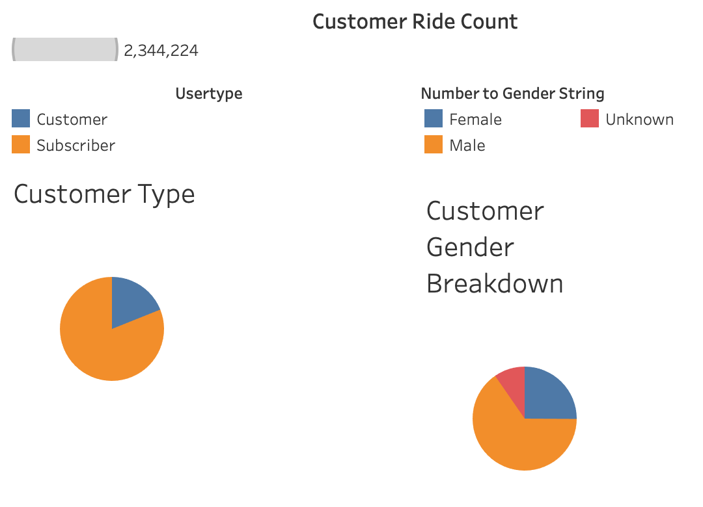
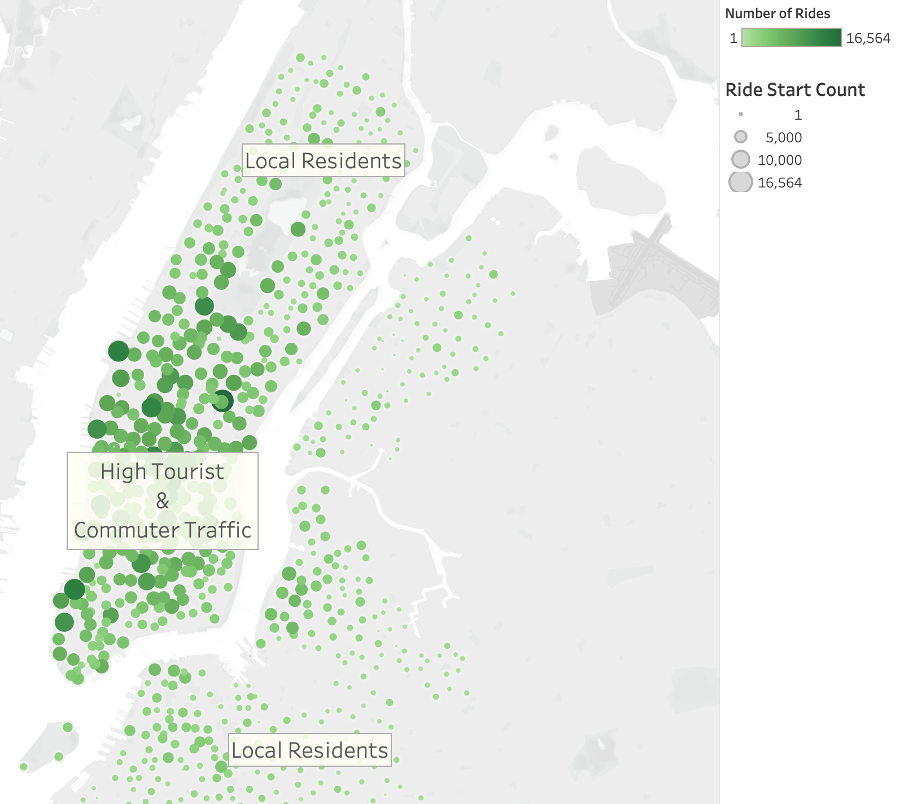

# Bikesharing with NYC CitiBike data
An analysis of NYC CitiBike bikesharing data from August, 2019, with Tableau

## Overview
This Tableau story can be seen, in its entirety, [at this link](https://public.tableau.com/views/NYCCitiBikeAnalysischallenge/NYCCitiBikeAnalysis?:language=en&:display_count=y&publish=yes&:toolbar=n&:origin=viz_share_link).

The framework for this project was to analyze bikeshare data from CitiBike in New York City for presentation to investors looking to begin a bikeshare program in Des Moines, Iowa. While Des Moines is a long way away from the hustle and bustle of NYC, this analysis might help answer a few key questions:
- Who uses bikeshare programs?
- What area of a city sees the most bikeshare usage?
- What time of day are bikes used the most and the least?
- How much are the bikes used and by whom?

## Results
While the demographics of Des Moines may be different from the make up of the citizenry of NYC, a cursory look at the makeup of CitiBike riders may shine light on who bikeshare might appeal to, regardless of locale.
***

In the above image we can see that more than 3/4 of the users are *Subscribers*, who make regular use of the bikes and are a predictable source of income for the program. Bikeshare program users are also predominantly male, at approximately 5/8 to only about 1/4 female. The remaining 1/8 gender is unknown or undeclared.
***

## Summary

